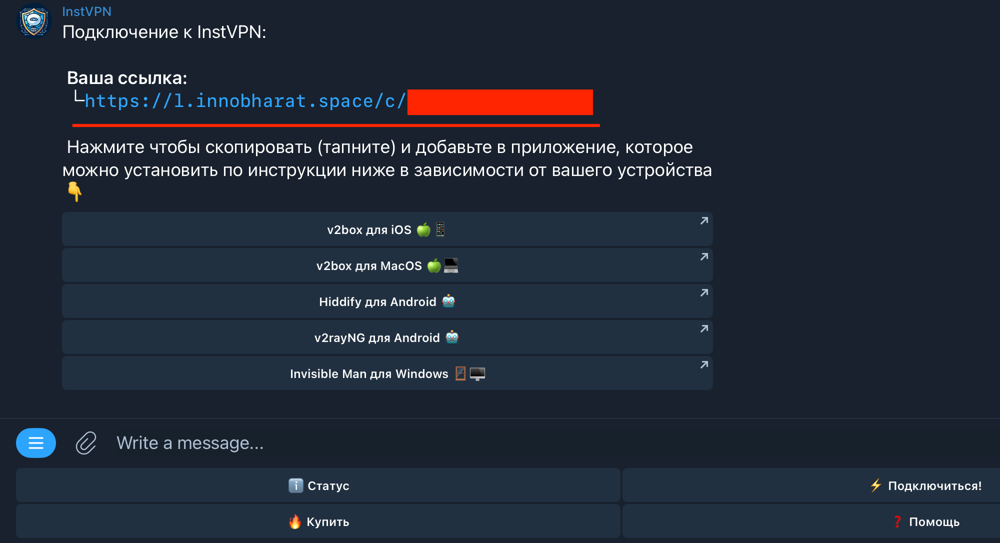
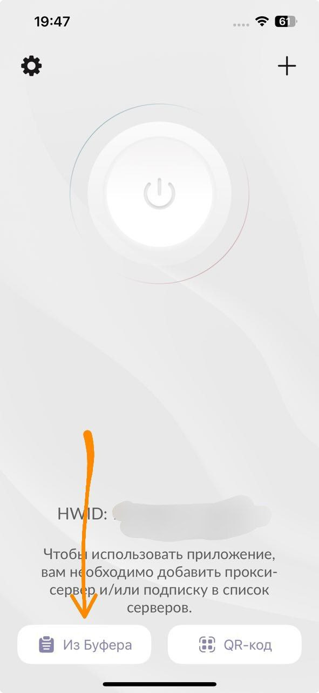
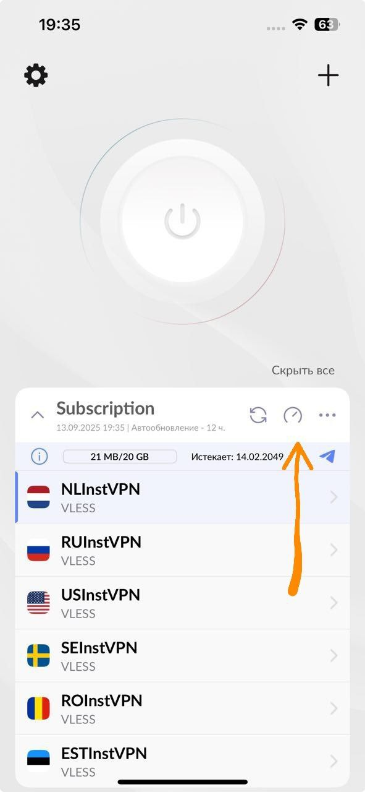
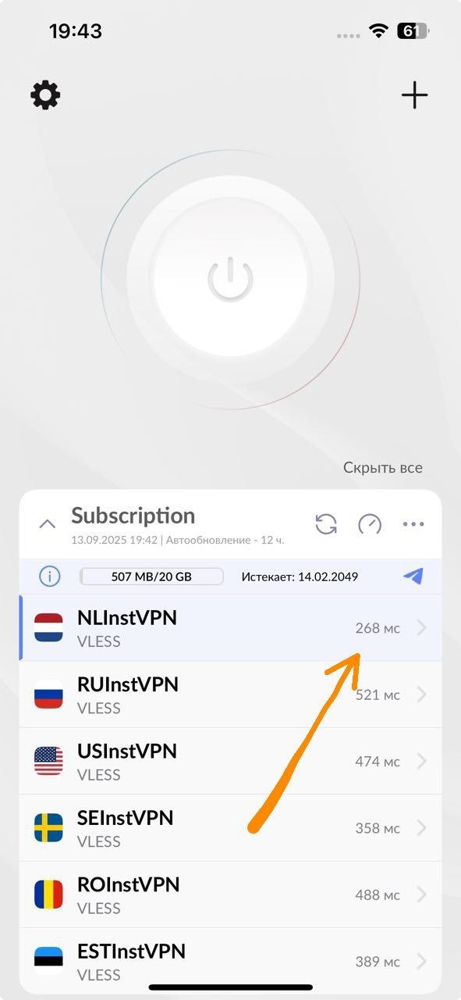
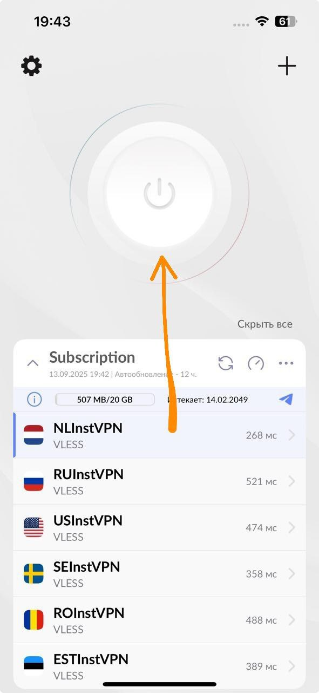
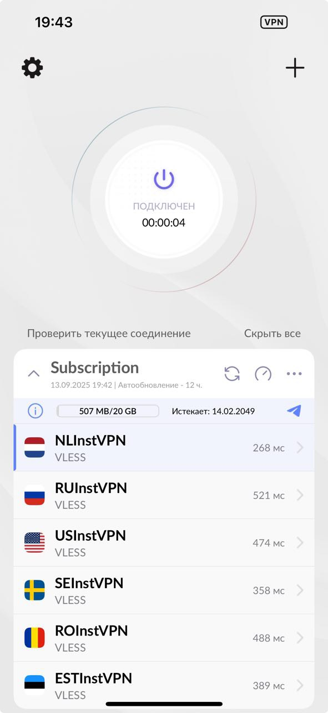

# **iOs-Happ**

Сентябрь 13, 2025

Установка Happ:

**1. Загрузка приложения:**

Перейдите в App Store: [https://apps.apple.com/ru/app/happ-proxy-utility-plus/id6746188973](https://apps.apple.com/ru/app/happ-proxy-utility-plus/id6746188973)
или вбейте в поиске "Happ - Proxy Utility", если не открывает по ссылке

Установите приложение "Happ".

**2. Настройка Happ:**

Запустите приложение Happ.

Скопируйте вашу ссылку для подключения из бота(нажмите кнопку "⚡️ Подключиться!")

Добавление профиля:

Нажмите на кнопку "Из буфера".

Появится новая подписка ниже. 
Нажмите на иконку проверки пинга 

Выберите подходящую локацию. 

Нажмите кнопку "Подключиться".

Дождитесь изменения статуса на "Подключен".

Вы великолепны! Наслаждайтесь интернетом без ограничений!

Автоматическая маршрутизация
клиент Happ умеет автоматически распределять трафик. Часть сайтов может открываться напрямую, а остальные - через VPN. Это удобно и не требует ручной настройки.

Чтобы включить маршрутизацию, перейдите по  специальной ссылке  на устройстве, где установлен Happ.
<button onclick="window.location.href='happ://routing/add/ewogICAgIkJsb2NrSXAiOiBbCiAgICBdLAogICAgIkJsb2NrU2l0ZXMiOiBbCiAgICBdLAogICAgIkRpcmVjdElwIjogWwogICAgICAgICJnZW9pcDpSVSIsCiAgICAgICAgImdlb2lwOlBSSVZBVEUiCiAgICBdLAogICAgIkRpcmVjdFNpdGVzIjogWwogICAgICAgICJnZW9zaXRlOlBSSVZBVEUiLAogICAgICAgICJnZW9zaXRlOkNBVEVHT1JZLUdPVi1SVSIsCiAgICAgICAgImdlb3NpdGU6Q0FURUdPUlktUlUiLAogICAgICAgICJnZW9zaXRlOkFQUExFIiwKICAgICAgICAiZ2Vvc2l0ZTpUV0lUQ0giCiAgICBdLAogICAgIkRuc0hvc3RzIjogewogICAgICAgICJjbG91ZGZsYXJlLWRucy5jb20iOiAiMS4xLjEuMSIsCiAgICAgICAgImRucy5nb29nbGUiOiAiOC44LjguOCIKICAgIH0sCiAgICAiRG9tYWluU3RyYXRlZ3kiOiAiSVBJZk5vbk1hdGNoIiwKICAgICJEb21lc3RpY0ROU0RvbWFpbiI6ICJodHRwczovL2Rucy5nb29nbGUvZG5zLXF1ZXJ5IiwKICAgICJEb21lc3RpY0ROU0lQIjogIjguOC44LjgiLAogICAgIkRvbWVzdGljRE5TVHlwZSI6ICJEb0giLAogICAgIkZha2VETlMiOiAiZmFsc2UiLAogICAgIkdlb2lwdXJsIjogImh0dHBzOi8vZ2l0aHViLmNvbS9mcmF5WlYvc2ltcGxlLXJ1LWdlb2lwL3JlbGVhc2VzL2xhdGVzdC9kb3dubG9hZC9nZW9pcC5kYXQiLAogICAgIkdlb3NpdGV1cmwiOiAiaHR0cHM6Ly9naXRodWIuY29tL2ZyYXlaVi9zaW1wbGUtcnUtZ2Vvc2l0ZS9yZWxlYXNlcy9sYXRlc3QvZG93bmxvYWQvZ2Vvc2l0ZS5kYXQiLAogICAgIkdsb2JhbFByb3h5IjogInRydWUiLAogICAgIkxhc3RVcGRhdGVkIjogIjE3Njk2ODYxNDIiLAogICAgIk5hbWUiOiAiSW5zdFZQTl9yb3V0aW5nIiwKICAgICJQcm94eUlwIjogWwogICAgXSwKICAgICJQcm94eVNpdGVzIjogWwogICAgICAgICJnZW9zaXRlOllPVVRVQkUiLAogICAgICAgICJnZW9zaXRlOkNBVEVHT1JZLUJBTi1SVSIKICAgIF0sCiAgICAiUmVtb3RlRE5TRG9tYWluIjogImh0dHBzOi8vY2xvdWRmbGFyZS1kbnMuY29tL2Rucy1xdWVyeSIsCiAgICAiUmVtb3RlRE5TSVAiOiAiMS4xLjEuMSIsCiAgICAiUmVtb3RlRE5TVHlwZSI6ICJEb0giCn0K'">Добавить маршрутизацию в Happ</button>

Также можно просто скопировать ссылку и открыть её в любом браузере.

Приложение Happ запустится автоматически и загрузит необходимые geo-файлы. После этого маршрутизация сразу начнёт работать.

Проверить или изменить настройки можно в приложении:
Настройки → Правила маршрутизации.

При необходимости маршрутизацию можно отключить - тогда весь трафик будет проходить через VPN.

Если у вас возникли сложности - пожалуйста напишите в техподдержку. Мы поможем. 
